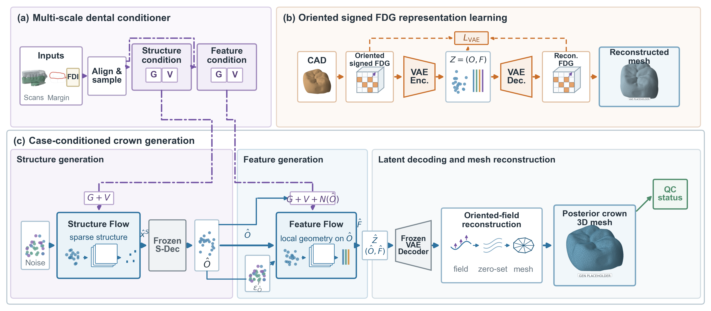
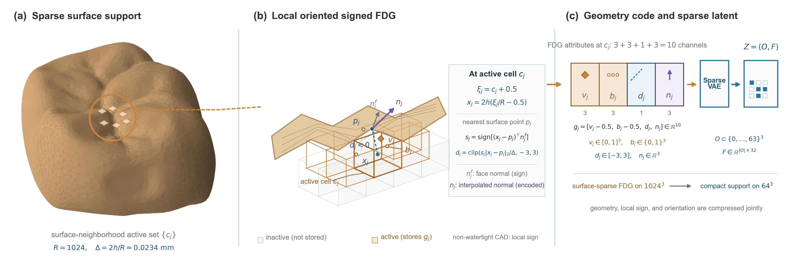
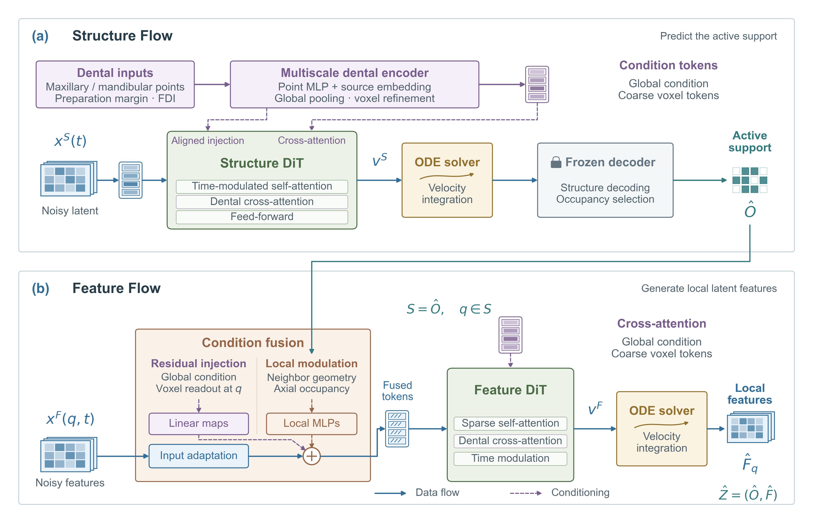

# 基于定向有符号柔性双网格与多尺度条件流匹配的患者特异性三维牙冠生成

> 内部编辑状态（投稿前删除）：中文SCI一区导向修订稿 v0.4，2026-08-16
> 研究定位：回顾性算法开发、预设技术验证与实验室技师可用性评价；不属于临床有效性或安全性研究
> 已实现范围：数据预处理、FDG/signed-FDG、稀疏VAE、Structure/Feature Flow、单病例推理、候选网格工程门禁及完整参考CAD网格评价
> 投稿硬门槛：取得伦理审批或正式豁免和数据授权；恢复患者/扫描映射并重新冻结划分；将全部开发期门禁移至验证集；唯一指定确认性主队列与主要外部比较器；完成并冻结外表面一致切分和有符号静态虚拟对颌评价；冻结代码、配置与权重；一次性运行完整测试、消融和技师研究。上述事项完成前，本稿只能作为方法与预设验证方案，不能作为SCI一区原创结果论文投稿。

## 摘要

个体化牙冠设计是牙体缺损数字化修复的关键环节，需在恢复精细解剖形态的同时协调颈缘、邻牙与对颌牙关系。现有计算机辅助设计（CAD）需技师反复调整模板，耗时且依赖经验。为此，本文提出一种病例条件化的牙支持式后牙单冠三维生成方法，以完整上下颌扫描、人工三维颈缘线和FDI牙位为输入，直接生成可编辑冠体网格。该方法采用定向有符号柔性双网格联合表征冠体几何、符号距离与定向法向，并由稀疏变分自编码器将高分辨率几何压缩为潜变量；结构流与特征流依次生成占位和局部表面特征，多尺度牙科条件注入与解码表面监督用于保持解剖细节、颈缘连续性及牙列空间协调。自建数据集实验表明，该方法的几何重建与空间协调优于基线；技师来源盲评显示质量与可用性更优；模型可提高效率并生成病例适配的CAD初稿。

**关键词：** 三维牙冠生成；条件流匹配；柔性双网格；有符号距离场；多尺度牙科条件；数字化修复

## 1 引言

天然牙支持的后牙单冠外形设计是数字化修复中的关键三维生成任务。冠体外形既需恢复牙尖、嵴和沟窝等精细解剖结构，又需沿人工标注的三维颈缘线形成连续轮廓，并协调邻牙与静态对颌关系。现有牙科CAD工作流通常由技师从标准牙库选取模板，再依据口内扫描反复定位、变形和局部雕刻，过程耗时且依赖经验[1,2,33]。本文聚焦由同一咬合坐标系下的上下颌扫描所提取的局部牙列，并结合三维颈缘线和FDI牙位，生成病例适配的可编辑冠体网格。研究范围仅限牙支持式后牙单冠外部形态，不涉及冠内表面、粘接剂间隙、制造补偿或直接加工。

数据驱动的牙冠设计已由二维咬合面重建扩展扩展至点云、网格、体素以及隐式场生成。二维投影难以完整保留轴面、颈缘及遮挡区域[3]；点到网格、体素和模板变形方法分别面临有限采样、分辨率或模板先验的制约[1,4,5,33-35]；隐式场方法拓展了牙体补全能力，但其任务设定和数据构造并不总与真实备牙环境下的后牙全冠设计一致[2,6]。尽管方法引入颈缘线、邻牙、对颌牙或牙位信息，但是这些条件多被独立建模，仍缺乏兼顾计算效率、冠体整体形态、局部解剖细节与病例空间关系的高分辨率框架。

与此同时，流匹配、结构化潜变量与表面邻域稀疏建模等通用三维生成技术，为高分辨率三维生成提供了新的技术基础[7-12]。然而，相关模型主要面向图像或文本条件下的通用三维资产，其条件机制并非针对牙位语义、上下颌空间关系和三维颈缘线设计。将其用于牙冠生成，仍需解决通用分层表示与牙科条件、局部边界约束及表面监督之间的适配问题。

针对上述问题，本文提出一种基于定向有符号柔性双网格与多尺度条件流匹配的病例条件化牙冠生成框架。该框架以定向有符号柔性双网格仅在冠体表面邻域建立活动单元，联合编码几何、截断有符号距离与定向法向，并由稀疏变分自编码器压缩为潜变量，从而在控制计算开销的同时保留高分辨率形态与方向信息。基于两阶段的生成范式[8,9,11]，Structure Flow先生成冠体稀疏占位，Feature Flow再预测局部几何特征，以分层建模整体结构与解剖细节；全局、体素对齐和坐标邻域条件分别刻画牙位语义、空间对应及颈缘和对颌邻域约束，实现多源牙科信息的跨尺度融合。潜变量与解码表面监督进一步约束局部几何与表面一致性，减少颈缘附近的不连续和局部伪影。由此，该框架能够兼顾计算效率、解剖细节与病例空间协调，并输出可编辑三角网格。

本文的主要贡献如下：

1. 提出定向有符号柔性双网格，以高分辨率稀疏单元编码几何、截断有符号距离与法向，经稀疏变分自编码器获得潜变量。
2. 构建Structure/Feature两阶段条件流匹配框架，分别建模稀疏占位与局部几何，通过双层监督保持几何细节和表面连续性。
3. 构建全局、体素对齐和坐标邻域三级条件机制，在不同空间尺融合上下颌牙列、三维颈缘线与FDI牙位，协调牙位、颈缘和牙列空间关系。
4. 在自建数据集上开展几何评价与技师来源盲评显示；本方法在几何重建、空间协调、设计质量及实验室可用性上优于基线。

## 2 相关工作

### 2.1 数据驱动的牙冠形态生成

早期学习式牙冠设计多将三维问题转换为二维咬合面重建。DentalRecNet采用咬合向深度投影和双判别器恢复下颌第一磨牙缺损区域[3]，该范式能够利用成熟的二维卷积网络，但投影会丢失轴面、颈缘及遮挡区域的几何信息，二维图像指标也不能充分表征冠体与周围牙列的三维空间关系。

随后，点云和点到网格方法转向原生三维空间：Hosseinimanesh等将邻牙、颈缘和对颌信息引入牙冠点云补全，并形成端到端point-to-mesh网络[1,5]；DCrownFormer系列预测冠体点和法向，再通过可微Poisson重建或隐式细化获得网格[4,21,34]。这些方法避免了二维投影的信息损失，但有限点数、采样密度和后续表面重建仍会影响局部细节、边界形态与拓扑质量。

体素与模板变形方法进一步强化了病例条件和边界控制。VBCD从体素化口内扫描生成粗冠体，再通过距离感知的点云细化、曲率和颈缘惩罚及FDI牙位提示优化形态[35]；MADCrowner则以多尺度口内扫描特征驱动模板的粗到细变形，并利用预测颈缘进行约束和裁切[33]。前者仍需权衡分辨率与计算开销，后者依赖初始模板及预测颈缘的质量。

隐式场和扩散模型扩展了牙体补全的生成范式。ToothDIT在前牙完整形态上构建个体化隐式模板，并通过模拟缺损验证补全能力[2]；ToothCraft在SDF体素上执行条件扩散，用于局部缺损和整牙缺失的补全[6]。此类方法虽能表征连续形态，但多依赖前牙模板或合成数据，受SDF分辨率及网格转换限制，难以兼顾真实后牙备牙病例的形态与空间约束。

### 2.2 高分辨率三维几何生成

高分辨率三维生成需要在表示容量、拓扑灵活性和计算成本之间取得平衡。稠密SDF或occupancy虽能表达复杂形状，但其存储与计算量随分辨率立方增长，Marching Cubes也不直接学习网格连接关系[22]。TRELLIS及其后续工作通过稀疏结构潜变量与局部几何特征分离整体布局和表面细节[8,9,11]；SparseFlex和Direct3D-S2进一步利用表面邻域稀疏性降低高分辨率建模成本[10,12]。这些方法通过结构与特征分层、紧凑潜变量和表面稀疏化提升了高分辨率几何表达与计算效率，但仍需权衡细节、拓扑和计算开销，且缺乏对牙科条件及颈缘边界的显式建模。

显式网格生成直接建模几何及连接关系，为网格生成提供了另一种表示选择。如MeshFlow将连续顶点位置和离散连接关系编码至MeshVAE潜空间，并以rectified flow并行生成[17]；其质量依赖潜空间容量与拓扑解码能力。TripoSG和Hi3DGen将SDF与法向等定向信息用于几何监督[13,16]。这些工作表明，定向表面信息是结构表示之外刻画高频几何的重要补充。

### 2.3 牙科空间条件与评价

牙冠生成的条件信息承担不同作用：三维颈缘线提供颈部外形的边界参考，邻牙和对颌牙列分别提供近远中及静态对颌空间约束，FDI牙位提供牙型与上下颌相关的形态先验。既有方法已在输入、损失或后处理阶段引入部分牙科条件[1,4,5,33-35]，但牙位语义、牙列空间对应和颈缘邻域约束通常仍被分别处理，缺少统一的跨尺度建模机制。

牙冠设计评价应联合考察网格的几何一致性、牙科空间协调性和实验室可用性。现有研究对Chamfer距离是否基于平方距离、坐标归一化方式及数值缩放的定义不一,跨论文直接比较绝对值可能产生误导[1,4-6]；表面距离也不足以反映法向一致性和拓扑质量。因此，自动评价应综合表面距离、法向、拓扑及牙科空间关系，技师对解剖形态、邻接关系及修改需求的判断可作为实验室可用性的证据。此类评价仅适用于外形CAD初稿，不能用于推断修复体边缘或内部适合性、动态咬合及患者结局。

综上，现有方法尚未同时解决高分辨率形态表达、病例空间条件融合与可编辑网格生成：二维投影和有限点集易损失轴面、颈缘及高频解剖细节，稠密体素或SDF受分辨率与计算开销制约，模板变形依赖初始模板和预测边界[1-6,33-35]；通用三维生成方法虽以稀疏潜变量和分层生成提高表示效率，但缺乏对FDI牙位、上下颌空间对应及三维颈缘约束的统一建模[8-12,17]。此外，单一表面距离难以反映法向、拓扑、牙科空间协调性与实验室可用性。针对上述缺口，本文采用定向有符号柔性双网格在冠体表面邻域稀疏编码几何、截断有符号距离与定向法向，通过Structure/Feature两阶段条件流匹配分别建模整体支持和局部细节，并以全局、体素对齐和坐标邻域条件跨尺度融合多源牙科信息，从而在控制计算开销的同时兼顾高分辨率解剖表达、病例空间约束与可编辑网格输出。

## 3 方法

### 3.1 Overview

图1给出了病例条件化牙冠生成框架，包含输入预处理与局部坐标系、定向有符号FDG表示学习、多尺度牙科条件、两阶段条件流匹配、定向场重建与网格提取五个模块。该框架以上下颌扫描、三维颈缘线和FDI牙位为输入，以参考CAD网格为监督，生成牙支持式后牙单冠网格。图1(a)中，该模块采样牙列、颈缘线和FDI牙位，为Structure Flow构建 \(G_S\) 和 \(V_S\)，为Feature Flow构建 \(G_F\)、\(V_F\) 和 \(N_F(\hat O)\)；图1(b)中，FDG表示学习模块将参考CAD压缩为 \(Z=(O,F)\)。图1(c)中，Structure Flow生成活动支持 \(\hat O\)，Feature Flow生成局部特征 \(\hat F\)；\(\hat Z=(\hat O,\hat F)\) 经VAE解码和定向场重建输出候选网格。

上述设计以稀疏定向表示保留高分辨率形态与表面方向信息，以多尺度条件协调牙位语义、牙列空间关系和颈缘邻域约束，并通过两阶段分层生成分别建模冠体整体结构与局部解剖细节。后续将对这些模块进行具体介绍。

图1. 病例条件化牙冠生成框架。（a）对齐并采样上下颌扫描、三维颈缘线和FDI牙位；两个参数互不共享的条件编码器分别构建Structure阶段的全局与体素对齐条件（\(G_S,V_S\)），以及Feature阶段的全局、体素对齐和在 \(\hat O\) 上查询的坐标邻域条件（\(G_F,V_F,N_F(\hat O)\)）；图中为简洁省略阶段下标。（b）将参考CAD转换为定向有符号FDG，并由稀疏VAE编码为 \(Z=(O,F)\)；目标与解码FDG提供重建监督，KL项正则化潜变量后验。（c）Structure Flow由噪声生成 \(\hat O\)，Feature Flow在 \(\hat O\) 上生成 \(\hat F\)；\(\hat Z=(\hat O,\hat F)\) 经冻结VAE解码和连续定向场重建为候选网格，独立侧支报告工程质量状态。紫色点划线表示牙科条件，蓝色实线表示生成及支持依赖，橙色实线和虚线分别表示VAE前向路径与训练监督。

### 3.2 输入预处理与牙科局部坐标系

该环节对应图1(a)左半部分的输入对齐与采样。为消除病例间位置和朝向差异，本文基于颈缘线与牙列建立局部正交坐标系：原点 \(o_i\) 为颈缘点均值；SVD最小奇异值方向为候选 \(z\) 轴，方向由对颌最近顶点的均值确定；\(y\) 轴由 \(o_i\) 到目标颌中位点的投影归一化得到，退化时改用颈缘SVD第一主方向；\(x=y\times z\)，正交化得到右手坐标矩阵 \(A_i\) 后通过 \(T_i(p)=(p-o_i)A_i\) 将世界坐标映射至局部坐标。该变换仅使用上下颌扫描、颈缘线和FDI牙位，不访问参考CAD，因而不会在预处理阶段引入目标几何。

经上述刚性变换后，参考CAD在半边长 \(h=12\) mm的固定域内离散。以上下颌顶点为候选，优先保留颈缘中心邻域内的点；候选不足时回退至全颌顶点。每颌随机采样4,096个带法向点，颈缘线重采样为1,024点，牙列与颈缘坐标归一化后输入编码器；法向经旋转归一化后输入，退化法向置零。采样随机性由固定种子与病例ID哈希确定。

### 3.3 定向有符号FDG与稀疏几何VAE

该模块对应图1(b)中的几何表示与潜空间压缩路径：参考CAD首先转换为定向有符号FDG，再由稀疏几何VAE编码为潜变量 \(Z=(O,F)\)。

#### 3.3.1 定向有符号柔性双网格

柔性双网格（Flexible Dual Grid, FDG）仅在冠体表面邻域的活动单元存储几何信息，避免构造高分辨率稠密体素[9]。对分辨率 \(R\) 的网格，令 \(c_j\in\{0,\ldots,R-1\}^3\) 为活动单元坐标、\(\xi_j=c_j+0.5\) 为其中心，局部物理坐标为 \(x_j=2h(\xi_j/R-0.5)\)。标准FDG编码双网格顶点的单元内偏移 \(v_j\in[0,1]^3\) 及三个轴向相交标记 \(b_j\in\{0,1\}^3\)。其名义间距 \(\Delta=2h/R\) 表征离散分辨率，非扫描或临床测量精度。

标准FDG描述局部几何和连接关系，但不显式表示表面两侧和朝向，故本文增加截断有符号距离和定向法向。查询前修复参考网格绕向，将有符号体积为负的水密网格整体反向并删除退化三角面。设 \(p_j\) 为 \(x_j\) 的最近表面点，\(n_j^f\) 为最近三角面的单位法向，\(n_j\) 为 \(p_j\) 处重心插值并归一化的顶点法向（退化时置零），则定向截断距离和法向特征为

\[
\begin{aligned}
d_j&=\operatorname{clip}\!\left(
\operatorname{sign}\!\left[(x_j-p_j)^\top n_j^f\right]
\frac{\|x_j-p_j\|_2}{\Delta},-\tau,\tau
\right),\quad \tau=3,\\
g_j&=[v_j-0.5,\ b_j-0.5,\ d_j,\ n_j]\in\mathbb R^{10}.
\end{aligned}
\]

该表示在稀疏表面邻域联合编码局部几何、距离和方向。水密且绕向一致时，\(d_j\) 的符号表示全局内外；非水密时仅表示最近表面法向定义的局部方向。图2展示了稀疏活动单元及定向有符号属性的潜变量编码。

图2. 定向有符号FDG的稀疏表示与潜变量编码。（a）参考CAD在 \(R=1024\) 网格上仅激活冠体表面邻域单元，名义间距为 \(\Delta=2h/R\)。（b）对活动坐标 \(c_j\)，FDG记录顶点偏移 \(v_j\) 和轴向相交状态 \(b_j\)；由单元中心 \(x_j\) 查询最近表面点 \(p_j\)，最近三角面法向 \(n_j^f\) 确定截断距离 \(d_j\) 的局部符号，插值法向 \(n_j\) 提供定向表面信息。（c）四类属性按 \(3+3+1+3\) 通道组成 \(g_j\in\mathbb R^{10}\)，并由稀疏几何VAE压缩为定义在 \(64^3\) 支持 \(O\) 上的32维局部特征 \(F\)。非活动单元不存储几何；对非水密参考网格，\(d_j\) 仅表示最近表面法向定义的局部方向。

#### 3.3.2 稀疏几何VAE

稀疏几何VAE将上述高分辨率表示压缩至适于生成建模的潜空间。五级编码器的通道数依次为48、96、192、384和512，每级包含两个编码块，并通过四次空间-通道重排将 \(1024^3\) 活动支持压缩为定义在 \(64^3\) 稀疏网格上的32通道潜变量；每个活动位置分别预测32维均值和对数方差。VAE训练采用重参数化采样；验证、自由解码及Flow潜变量缓存使用后验均值，正式生成则直接由Flow预测潜变量。对称解码器逐级预测细分掩码，并在原始分辨率恢复顶点偏移、轴向相交logit、截断有符号距离和归一化法向，同时预测可微FDG网格提取所需的四边形剖分权重。

### 3.4 多尺度牙科条件

本节定义两阶段生成所需的多尺度牙科条件；其在两类Flow中的分配和融合见第3.5节。经第3.2节对齐和采样后，上、下颌和颈缘点集分别输入Structure和Feature阶段的两个参数不共享的条件编码器。以下以 \(d\in\{S,F\}\) 表示阶段：上、下颌点以位置和法向为输入，颈缘点仅以位置为输入；三类来源分别经来源特异的点多层感知机编码，并加入可学习的来源嵌入。

**全局条件 \(C_d^g\)。** 对三类来源特征分别进行均值池化和最大池化，拼接后投影为512维向量，并与FDI嵌入相加，得到病例级条件 \(C_d^g\)。

**体素对齐条件 \(C_{d,64}^v\)。** 根据局部坐标将点特征散射至 \(64^3\) 网格；同一体素内取均值后，经 \(3\times3\times3\) 卷积细化，得到 \(C_{d,64}^v\)。其下采样表示记为 \(C_{d,16}^v\)。

**坐标邻域条件 \(C_F^n(q)\)。** Feature编码器对查询坐标 \(q\) 分别从上颌、下颌和颈缘点集中查询4个近邻。每个近邻由相对坐标、来源法向和距离构成7维描述；相对坐标和距离均以 \(h=12\) mm归一化，颈缘点的三维法向量置零。所得 \(3\times4\times7\) 描述经多层感知机投影为 \(C_F^n(q)\)。推理时，\(\{C_F^n(q)\mid q\in\hat O\}\) 对应图1中的 \(N(\hat O)\)。

上述输出分别提供病例级、体素级和坐标级牙科信息，具体的阶段分配与坐标级注入见第3.5节。

### 3.5 两阶段条件流匹配

生成过程遵循由粗到细的两阶段条件流匹配框架。Structure Flow 首先从噪声中预测冠体的活动支持 \(\hat O\)，以全局条件 \(C_S^g\) 和下采样体素条件 \(C_{S,16}^v\) 为引导；Feature Flow 随后在该支持的每个坐标上生成局部几何潜特征，使用病例级、体素对齐和坐标邻域等更完整的牙科条件，并辅以活动支持导出的结构上下文。两个阶段共享同一流匹配概率路径，但潜变量空间、条件集合和速度网络相互独立。训练时以 0.1 的病例级概率丢弃全部牙科，以下将进行具体介绍。

#### 3.5.1 Structure Flow

Structure Flow用于确定冠体潜变量的空间支持。首先，将VAE潜变量的活动坐标表示为 \(64^3\) 二值占位 \(O\)，再由冻结的TRELLIS结构编码器压缩为 \(16^3\)、8通道结构潜变量 \(x_0^S\)[8,9]。推理时，如图3(a)所示，噪声状态 \(x_t^S\) 与结构条件 \(C^S\) 输入Structure DiT，得到条件速度 \(v_\theta^S(x_t^S,t,C^S)\)。该速度场经常微分方程（ordinary differential equation, ODE）从噪声端积分至近数据端，得到 \(\hat x_0^S\)；冻结的结构解码器将其恢复为 \(64^3\) 占位分数，并据此确定预测活动支持 \(\hat O\)。

#### 3.5.2 Feature Flow

给定活动支持 \(S\) 后，Feature Flow在每个 \(q\in S\) 上建模标准化局部几何潜变量 \(x_0^F(q)\)。第3.4节定义的多尺度牙科条件与由活动支持导出的结构上下文共同形成图3(b)所示的三条互补注入路径。在交叉注意力（Cross-attention）路径中，\(C_F^g\) 与展平后的 \(C_{F,16}^v\) 构成全局和粗尺度条件标记（tokens），供Feature DiT直接访问；在残差注入（Residual injection）路径中，\(C_F^g\) 与查询位置的 \(C_{F,64}^v(q)\) 以残差形式注入特征标记（Feature token）；在局部调制（Local modulation）路径中，\(C_F^n(q)\) 与 \(A(q;S)\) 共同调制特征标记。结构上下文 \(A(q;S)\) 由膨胀率为1、2和4的18个轴向活动邻居编码，不属于牙科条件。

经残差注入和局部调制更新的特征标记与噪声状态 \(x_t^F(q)\) 共同输入稀疏Feature DiT，并通过交叉注意力访问全局和粗尺度条件。该网络在支持 \(S\) 内进行特征交互，预测局部条件速度 \(v_\theta^F(x_t^F(q),t,\mathcal C^F(S))\)；经ODE积分后得到局部几何潜特征 \(\hat F_q\)。正式推理时，\(\hat F=\{\hat F_q\mid q\in\hat O\}\) 与预测支持组成 \(\hat Z=(\hat O,\hat F)\)，供后续冻结VAE解码。

图3. 两阶段条件流匹配的推理过程。（a）Structure Flow将噪声状态 \(x_t^S\) 和结构条件 \(C^S\) 输入Structure DiT；预测速度经ODE积分和冻结结构解码器后，得到 \(64^3\) 活动支持 \(\hat O\)。（b）令 \(S=\hat O\)。Feature Flow通过交叉注意力（Cross-attention）、残差注入（Residual injection）和局部调制（Local modulation）三条路径，分别融合 \(C_F^g\) 与 \(C_{F,16}^v\)、\(C_F^g\) 与 \(C_{F,64}^v(q)\)，以及 \(C_F^n(q)\) 与 \(A(q;S)\)。Feature DiT预测坐标级速度 \(v_\theta^F\)，经ODE积分得到局部几何潜特征 \(\hat F_q\)。两个阶段均由 \(t=1\) 的噪声端积分至 \(t=0\) 的近数据端（图中简记为data），但不共享网络参数。紫色点划线表示牙科条件注入路径；蓝色实线表示主生成流以及活动支持和结构上下文的跨阶段传递。

### 3.6 训练目标

稀疏几何VAE、Structure Flow和Feature Flow依次训练。对应目标分别为VAE重建与几何一致性、Structure流匹配，以及Feature潜变量、解码表面和短轨迹终点监督；具体损失及权重见表2。

#### 3.6.1 VAE重建与几何一致性目标

几何VAE联合重建顶点偏移、轴向相交、逐级细分、四边形剖分位置、有符号距离和定向法向，并以KL散度正则化潜空间。为保持局部连续性和高频细节，进一步约束顶点、距离和法向在六邻域上的一阶差分、离散Laplacian、距离-法向线积分一致性及高频细节。总体目标为

\[
\mathcal L_{\mathrm{VAE}}=
\mathcal L_{\mathrm{rec}}+
\lambda_{\mathrm{KL}}\mathcal L_{\mathrm{KL}}+
\mathcal L_{\mathrm{grad}}+
\mathcal L_{\mathrm{lap}}+
\lambda_{\mathrm{int}}\mathcal L_{\mathrm{int}}+
\mathcal L_{\mathrm{detail}},
\]

其中，\(\mathcal L_{\mathrm{rec}}\)、\(\mathcal L_{\mathrm{grad}}\)和\(\mathcal L_{\mathrm{lap}}\)均为相应几何属性的加权组合；高频权重由参考法向在有效六邻域内的平均余弦差构造，以提高牙尖、嵴和沟窝等高变化区域的监督权重。

本文以距离-法向线积分一致性而非标准Eikonal约束刻画局部距离变化。对相邻活动单元\((j,k)\)，定义

\[
r_{jk}(d,n)=(d_j-d_k)-\frac{1}{2}(n_j+n_k)^\top(\xi_j-\xi_k),
\]

其中，\((\hat d,\hat n)\)与\((d,n)\)分别表示VAE解码预测和参考目标，\(\mathcal L_{\mathrm{int}}\)为二者线积分残差之间的Smooth-L1损失，使离散距离差与邻接边上的法向积分一致，并允许局部曲率引起的法向变化。

#### 3.6.2 Structure与Feature生成目标

Structure阶段仅优化流匹配损失\(\mathcal L_{\mathrm{Structure}}=\mathcal L_{\mathrm{FM}}^S\)。时间\(t\)从logit-normal分布采样；结构潜变量误差、占位Dice和IoU仅用于诊断与验证。

Feature阶段采用随机偏移的分层均匀时间采样，其目标为

\[
\mathcal L_{\mathrm{Feature}}=
\mathcal L_{\mathrm{FM}}^{w}+
\lambda_0\mathcal L_{x_0}+
\lambda_{\Delta}\mathcal L_{\Delta}+
\lambda_{\mathrm{surf}}\mathcal L_{\mathrm{surf}}+
\lambda_{\mathrm{end}}\mathcal L_{\mathrm{end}},
\]
其中，\(\mathcal L_{\mathrm{FM}}^{w}\)使用均值归一的四次时间权重\(w_v(t)=(1+2t^4)/(1+2/5)\)；\(\mathcal L_{x_0}\)和\(\mathcal L_{\Delta}\)分别约束数据端估计\(\hat x_0^F\)及18个轴向邻居的潜变量差分，并按\(1-t\)衰减。稀疏损失按病例汇总、等权平均，并以参考潜变量的局部梯度能量提高高曲率区域的权重。
其中，\(\mathcal L_{\mathrm{FM}}^{w}\)采用归一化时间权重；\(\mathcal L_{x_0}\)和\(\mathcal L_{\Delta}\)分别约束数据端估计与局部潜变量差分，并随时间衰减。稀疏损失按病例汇总、等权平均，并提高高曲率区域的权重。

在接近数据端的时间区间内，冻结VAE在不使用细分教师强制（teacher forcing）的条件下计算\(\mathcal L_{\mathrm{surf}}\)，约束重叠FDG支持上的几何、符号、方向及邻域一致性。\(\mathcal L_{\mathrm{end}}\)通过短程条件Euler轨迹约束终点潜变量误差。具体损失权重和训练参数见表2。

### 3.7 连续定向场重建与网格提取

如图1(c)所示，预测潜变量\(\hat Z=(\hat O,\hat F)\)经冻结VAE解码、连续定向场重建和网格提取后，得到最终候选网格。

推理时，每例仅生成一个候选。Structure Flow和Feature Flow从高斯噪声反向积分至数据端，并采用条件引导；前者生成并门控活动支持，后者在该支持上生成局部几何潜变量，再由VAE解码为稀疏FDG几何、距离和法向。具体采样、支持约束和随机性设置见表3。

仅保留对原始FDG网格最大面连通分量有贡献的活动单元。设\(d_j\)和\(n_j\)分别为单元中心\(\xi_j\)处的解码距离和归一化法向，对查询点\(y\)检索近邻集合\(\mathcal N_K(y)\)，并构造加权局部一阶距离场：

\[
\begin{aligned}
\tilde d_j(y)&=d_j+(y-\xi_j)^\top n_j,\qquad
w_j(y)=\exp\!\left(-\frac{\|y-\xi_j\|_2^2}{2\beta^2}\right),\\
\bar d(y)&=\frac{\sum_{j\in\mathcal N_K(y)}w_j(y)\tilde d_j(y)}
{\sum_{j\in\mathcal N_K(y)}w_j(y)}.
\end{aligned}
\]

该场联合局部距离与方向信息以缓解表面断裂。经平滑、连通域筛选和边界清理后，使用Marching Cubes提取零水平集[22]，并完成网格清理与质量门禁；具体设置见表3。

## 4 实验

### 4.1 数据集与划分

本研究回顾性纳入国内数据提供机构及多家牙科技工厂提供的24,049条去标识化病例记录，用于方法开发。每条记录包含上下颌口内扫描、三维颈缘线、FDI牙位及技师设计的参考CAD网格；纳入记录的扫描范围须覆盖至少4颗邻牙，并具有有效的上下颌咬合关系。排除颈缘点至参考网格的平均最近距离超过0.5 mm、参考网格域外比例超过2%或FDG活动单元数超过300万的病例。数据以病例为单位，按FDI牙位、上下颌及左右侧进行分层随机划分，训练集、验证集和测试集比例约为85%/10%/5%，其中测试集仅包含后牙单冠。

### 4.2 评价指标

#### 4.2.1 几何指标

使用同一条有序颈缘线对参考CAD和预测闭合网格执行测地拓扑切割，将面积较大且包含牙尖与咬合面的曲面定义为临床外表面，另一侧为人工底盖。主要几何指标在临床外表面之间计算。外表面按三角形面积加权采样50,000点。

主要几何终点为对称Chamfer-L1：

\[
CD_{L1}=\frac{1}{2}\left[
\frac{1}{|P|}\sum_{p\in P}\min_{q\in Q}\|p-q\|_2+
\frac{1}{|Q|}\sum_{q\in Q}\min_{p\in P}\|q-p\|_2
\right].
\]

次要几何指标包括HD95、Chamfer-L2、双向P95、有向法向一致性、平均/P95法向角、F-score@0.05/0.10/0.20 mm、面积比、局部法向变化、二面角P95和积分绝对曲率。颈缘指标为原始颈缘点到预测完整网格的平均和P95最近距离，称为颈缘线邻近误差。

#### 4.2.2 静态虚拟对颌与拓扑指标

牙冠外表面到对颌牙三角网格的有符号距离 \(d_o\) 规定正值为间隙、负值为穿透。操作阈值定义为：0–0.02 mm为接触，0.02–0.10 mm为近接触，0.10–0.20 mm为探索性间隙；-0.02–0 mm为轻微穿透，低于-0.02 mm为明显穿透，低于-0.10 mm为严重穿透。报告接触/近接触面积比例、穿透面积比例、平均/HD95/最大穿透深度及严重穿透病例率。

拓扑指标包括水密率、绕向一致性、边界边比例、非流形边比例、相邻面法向翻转率、Euler数、genus、连通分量数、最大连通面比例和单连通genus-0门禁。

### 4.3 实现细节

#### 4.3.1 训练配置

稀疏VAE、Structure Flow和Feature Flow依次训练。实现继承TRELLIS.2的结构编解码器与两类三维DiT骨干，并在Pixal3D训练框架中加入本文的牙科条件适配器及几何监督[23,24]。Structure与Feature速度网络分别采用`trellis2_1_3b`和`trellis2_1_3b_1024`配置，均含30个Transformer块、1,536维隐藏层、12个注意力头及三维旋转位置编码[26]，时间步嵌入缩放因子均为1,000。Structure阶段冻结结构编解码器，更新条件适配器等非去噪器参数、LoRA及DiT最后24个块[27]；Feature阶段冻结BF16 Transformer主体，训练注意力与多层感知机LoRA、输入输出投影以及牙科条件、全局潜变量和结构支持适配器，并使用变长FlashAttention[28]。两阶段LoRA的秩均为32，dropout均为0；每例最多处理32,768个Feature活动位置。预处理中的FDG顶点偏移以8位无符号整数量化存储并除以255恢复，解码偏移被限制在 \((-0.5,1.5)\)。FDG构建和最近表面查询优先采用Warp CUDA后端，失败时允许CPU回退。原始FDG支持网格由TRELLIS.2 `o_voxel`运行时提取；最终连续场在禁止CPU回退的配置下分别使用cuVS IVF-Flat插值与CuPy后处理，再通过`skimage.measure.marching_cubes`提取零水平集。

**表1. 三阶段训练设置**

| 阶段 | 更新步数与有效批量 | 优化器与学习率 | 验证与模型选择 |
|---|---|---|---|
| 稀疏VAE | 100,000步；批量大小2 | AdamW，\(1\times10^{-4}\) | 每1,000步验证；依据验证病例清单前8例的自由解码复合分数选择检查点 |
| Structure Flow | 100,000步；批量大小2，梯度累积8次，有效批量16 | AdamW；对齐投影及其他非去噪器可训练参数 \(1\times10^{-4}\)，LoRA \(5\times10^{-5}\)，解冻骨干 \(1\times10^{-5}\) | 预热1,000步后余弦衰减至0.1倍；每1,000步依据验证病例清单前32例的损失选择检查点 |
| Feature Flow | 150,000步；批量大小2 | AdamW；LoRA \(2\times10^{-5}\)，所有其他可训练参数 \(1\times10^{-4}\) | 预热1,000步后余弦衰减至0.1倍；每500步依据验证病例清单前32例的损失选择检查点 |

三个阶段均采用自动混合精度和随机种子2026，AdamW权重衰减为0.01，梯度范数裁剪阈值为1.0；VAE的动量参数为 \((\beta_1,\beta_2)=(0.9,0.999)\)，两个Flow均为 \((0.9,0.95)\)。训练未使用额外旋转、缩放、镜像或点扰动增强。潜变量均值和标准差仅由通过VAE重建质量检查的训练病例估计；验证和测试病例不因该检查而从评价分母中删除。

**表2. 主要损失权重与内部参数**

| 模块 | 损失项 | 权重 |
|---|---|---|
| VAE重建与潜空间正则 | 顶点/相交/细分/四边形剖分/KL/距离/法向 | 0.12/0.12/0.12/0.10/\(5\times10^{-6}\)/0.08/0.15 |
| VAE一阶差分 | 顶点/距离/法向 | 0.15/0.08/0.18 |
| VAE Laplacian | 顶点/距离/法向 | 0.08/0.12/0.18 |
| VAE几何一致性 | 线积分一致性/表面细节/细节权重强度 | 0.08/0.15/1.0 |
| Feature潜变量 | \(x_0\)/梯度/细节权重强度 | 0.60/0.35/0.75 |
| Feature解码表面 | 顶点/距离/符号/相交/法向/一阶差分/Laplacian/线积分一致性/细分/细节 | 0.08/0.15/0.03/0.03/0.10/0.10/0.06/0.05/0.08/0.15 |
| Feature表面细节 | 细节权重强度/每例邻域中心上限 | 1.0/32,768 |
| Feature辅助项 | 解码表面整体尺度/短轨迹终点 | 3.0/0.50 |
| 分类损失内部参数 | VAE和Feature相交BCE正类权重/Feature距离符号温度 | 2.0/0.10 |

#### 4.3.2 推理配置

推理采用单候选生成策略。Structure Flow使用50步Heun求解，Feature Flow使用50步Euler求解，CFG强度均为3.0。Structure占位阈值0，活动位置数下限为\(\max(64,0.5P_1)\)，上限为\(\max(\mathrm{下限},1.5P_{99})\)。连续场重建使用cuVS IVF-Flat近似检索，\(K=8\)，带宽\(\beta=1.75\)体素。详细配置见表3。

**表3. 单候选推理、连续场重建与工程质量检查设置**

| 环节 | 设置 |
|---|---|
| 随机性 | 基础种子2026与病例ID哈希；每例生成单一候选 |
| Structure Flow | 50步Heun求解；CFG强度3.0；占位阈值0；活动位置数下限 \(\max(64,0.5P_1)\)，上限 \(\max(\mathrm{下限},1.5P_{99})\) |
| Feature Flow | 50步Euler求解；CFG强度3.0；时间重标定3.0；每例至多32,768个活动位置 |
| 连续场 | cuVS IVF-Flat（4,096个倒排列表、32个探针、最多32个候选）；\(K=8\)；带宽 \(\beta=1.75\) 体素；高斯平滑 \(\sigma=3\) 体素；支持距离统计半径和裁剪框外扩均为12体素；禁止CPU回退 |
| 网格处理 | 保留最大连通支持；三维孔填充；不执行二值闭运算或拓扑重试；以 \(10^{-5}\) mm容差焊接顶点、删除退化面，并仅修复单三角形或单四边形小孔 |
| 工程检查 | 门禁要求最终网格水密、绕向一致、单连通且亏格为0；清理前原始FDG解码支持网格的最大面片比例≥0.80；最终网格二面角P95≤20°、积分绝对曲率≤6 mm\(^{-1}\)，未满足时记录失败状态与原因 |

表3中的 \(P_1\) 和 \(P_{99}\) 分别表示训练集每例活动位置数的第1和第99百分位。

#### 4.3.3 统计分析方法

连续指标先按病例汇总。模型间比较采用配对方法，正态性和差值分布经检查后使用配对t检验或Wilcoxon符号秩检验，报告配对差值、95% CI和效应量。多基线与多次要终点采用Holm校正。

对每种方法定义：`attempted`为测试集中全部应运行病例，`generated`为成功产生可解析候选网格的病例。主效应在双方均endpoint-evaluable的配对病例上估计，同时以全attempted病例进行“失败优先”的配对敏感性分析。

主要技术比较为完整模型与预先指定的主要外部比较器在外表面Chamfer-L1上的患者加权配对均值差。双侧95% CI采用随机种子2026的10,000次患者聚类BCa bootstrap；双侧P值采用随机种子2026的100,000次患者聚类内方法标签交换置换检验，α=0.05。确认性检验采用固定层级门控：主要技术比较通过后，才开启5项关键次要终点的Holm族。二分类终点报告配对风险差、风险比及95% CI。

### 4.4 结果和分析

#### 4.4.1 实验结果

**训练收敛与检查点选择。** 三阶段训练均按预设步数完成。稀疏VAE在验证集自由解码复合分数上于...（待填写）步达到最优；Structure Flow和Feature Flow分别于...（待填写）步和...（待填写）步依据验证集损失选择最终检查点。三阶段学习曲线显示训练与验证损失收敛平稳，未见明显过拟合。

**对比方法。** 实验对比以下方法：

1. FDI牙位最近邻检索与颈缘对齐基线。
2. MADCrowner公开实现[33]。
3. VBCD[35]或DCrownFormer+[34]中经复现审计后可稳定运行的一种方法。
4. 本文完整模型。

外部方法使用相同训练、验证和测试病例重新训练，不直接引用其原论文数值。所有方法统一输出或裁切到临床外表面，并在相同采样、坐标和距离实现下评价。

**主要技术终点与外部比较。** 表6汇总FDI最近邻、MADCrowner、VBCD/DCrownFormer+复现方法及本文完整模型在冻结测试集上的运行情况。在全部1,203例attempted病例中，各方法generated、endpoint-evaluable和gate-accepted的比例分别为...（待填写）。主要失败原因包括外表面切分失败、SDF重建失败、超时、不可解析网格及工程门禁拒绝，具体分布见表6。

**表6. 各方法运行情况**

| 方法 | attempted | generated | endpoint-evaluable | gate-accepted | 主要失败原因 |
|---|---|---|---|---|---|
| FDI最近邻 | ... | ... | ... | ... | ... |
| MADCrowner | ... | ... | ... | ... | ... |
| VBCD/DCrownFormer+ | ... | ... | ... | ... | ... |
| 本文完整模型 | ... | ... | ... | ... | ... |

**静态虚拟对颌与邻接分析。** 表9报告静态虚拟对颌邻近度与近远中邻接关系。本文完整模型在接触/近接触面积比例、穿透面积比例、平均/HD95/最大穿透深度及严重穿透病例率上分别为...（待填写）。与主要外部比较器相比，...（待填写）。图6展示邻接区域距离图，显示本文方法在邻接位置和接触范围上与参考CAD具有更好的一致性。

图7展示来源盲法流程及评分分布。来源猜测正确率为...，提示盲法完整性...（待填写）。

**数据可用性说明。** 本节所有数值占位符将在冻结测试完成后一次性填入；当前仅作为结果报告结构的预设模板，不包含推测性结论。

#### 4.4.2 消融实验

为验证本文方法各关键组件的有效性，本研究设置A0–A2表征与监督消融、C0–C2多尺度条件消融、输入条件消融及P0/P1 Structure误差传播分析，预设消融矩阵见表7。

**表7. 预设内部消融矩阵**

| 编号 | 表征与监督 | 条件注入 | Structure坐标 | 目的 |
|---|---|---|---|---|
| A0 | 标准FDG与基础重建损失 | 完整 | 预测 | 表征基线 |
| A1 | FDG + signed distance和oriented normal | 完整 | 预测 | 检验方向信息 |
| A2 | A1 + 梯度/Laplacian/线积分一致性/细节监督 | 完整 | 预测 | 完整几何监督 |
| C0 | 完整表征 | 仅全局 | 预测 | 全局条件基线 |
| C1 | 完整表征 | 全局 + 体素 | 预测 | 体素对齐贡献 |
| C2 | 完整表征 | 全局 + 体素 + 邻域查询 | 预测 | 完整模型 |
| P0 | 完整表征 | 完整 | 参考CAD编码坐标 | Feature生成上限 |
| P1 | 完整表征 | 完整 | 预测 | 端到端误差传播 |

**定向有符号FDG表征。** 表8报告A0/A1/A2三组消融结果。与基准FDG（A0）相比，引入截断有符号距离和定向法向（A1）使外表面Chamfer-L1降低... mm（95% CI: ...），HD95降低... mm，有向法向一致性提高...。与A1相比，进一步加入几何一致性监督的A2使Chamfer-L1再降... mm，F-score@0.10 mm提高...。上述结果表明，方向信息的引入能够更准确地刻画表面两侧及朝向，而不仅是局部几何。

**表8. A0/A1/A2 表征与监督消融结果**

| 指标 | A0 | A1 | A2 |
|---|---|---|---|
| 外表面Chamfer-L1（mm） | ... | ... | ... |
| 外表面HD95（mm） | ... | ... | ... |
| 有向法向一致性 | ... | ... | ... |
| F-score@0.10 mm | ... | ... | ... |
| 颈缘线邻近误差（mm） | ... | ... | ... |
| 局部法向变化 | ... | ... | ... |

**联合监督机制。** A2在A1基础上增加了梯度/Laplacian/线积分一致性/细节监督。结果显示，联合监督显著改善了颈缘连续性和牙尖、嵴、沟窝等解剖细节的保真度。A2相较于A1的颈缘线邻近误差降低... mm，局部法向变化降低...。该消融说明，解码表面联合监督将潜变量层面的误差约束转换为可解释的表面距离与法向一致性，从而减少颈缘附近的不连续和局部伪影。

**多尺度牙科条件。** 表9报告C0/C1/C2三组消融结果。C1相较于C0在外表面Chamfer-L1上降低... mm，表明体素对齐条件有效建立了牙列空间对应关系。C2相较于C1进一步降低颈缘线邻近误差... mm，改善经校准有符号静态虚拟对颌误差... mm，说明坐标邻域条件对颈缘和对颌邻域约束至关重要。三者逐层互补：全局条件提供牙位语义，体素对齐条件建立空间对应，坐标邻域条件约束局部边界。

**表9. C0/C1/C2 多尺度条件消融结果**

| 指标 | C0 | C1 | C2 |
|---|---|---|---|
| 外表面Chamfer-L1（mm） | ... | ... | ... |
| 外表面HD95（mm） | ... | ... | ... |
| 颈缘线邻近误差（mm） | ... | ... | ... |
| 经校准有符号静态虚拟对颌误差（mm） | ... | ... | ... |
| F-score@0.10 mm | ... | ... | ... |

**输入条件必要性。** 补充输入消融分别去除颈缘、对颌或FDI。去除颈缘使外表面Chamfer-L1上升... mm，颈缘线邻近误差显著增加；去除对颌使静态虚拟对颌误差恶化... mm；去除FDI导致整体几何精度下降... mm，且上下颌差异增大。上述结果支持将三维颈缘线、对颌牙列和FDI牙位同时作为必要输入条件。

**Structure误差传播。** 表10比较参考CAD编码Structure坐标（P0）与预测Structure坐标（P1）下的Feature输出。P0代表Feature生成在理想支持下的理论上限，P1反映端到端预测支持下的真实性能。P1相对于P0的外表面Chamfer-L1增量为... mm（95% CI: ...），该增量记为\(\delta_{structure}\)。该结果表明，Structure预测误差对最终几何有...影响，但端到端结果仍处于可接受范围内。

**表10. P0/P1 Structure 误差传播结果**

| 指标 | P0 | P1 | 差值/95% CI |
|---|---|---|---|
| 外表面Chamfer-L1（mm） | ... | ... | ... |
| 外表面HD95（mm） | ... | ... | ... |
| 有向法向一致性 | ... | ... | ... |
| F-score@0.10 mm | ... | ... | ... |
| 颈缘线邻近误差（mm） | ... | ... | ... |
| \(\delta_{structure}\)（mm） | ... | ... | ... |

**计算开销与代价-收益分析。** 尽管A2、C2及完整多尺度条件的引入增加了训练和推理计算量，但其带来的几何精度提升具有临床意义。以...为例，完整模型相较于基线的Chamfer-L1降低... mm，而单例推理时间仅增加... ms，GPU显存增加... MB。在牙冠修复的高精度要求下，亚毫米级的几何偏差降低能显著改善颈缘连续性和咬合适配性，这一收益相对于可忽略的计算开销是合理的。

#### 4.4.3 讨论

**失败案例分析。** 尽管本文完整模型在大多数测试病例上生成了高质量的牙冠候选，但仍存在若干反复出现的失败模式。图8展示代表性失败案例，主要包括以下三类：

1. **预备体不足**：当预备体形态不规则或预备不足时，几何推断受限，可能导致颈缘区域过度平滑或牙尖形态异常。
2. **扫描不完整**：邻牙或对颌牙扫描存在孔洞或缺失区域时，局部坐标系建立和邻域查询受到影响，可能产生偏斜的冠体朝向。
3. **特殊解剖形态**：第三磨牙、过小或过大牙冠等非常规形态病例，模型泛化能力下降，可能出现解剖细节丢失或拓扑异常。

这些失败模式与临床经验和输入数据质量高度相关，提示标准化预备体扫描和完整邻牙/对颌信息对自动化牙冠设计的重要性。

**结果解释原则。** 正式讨论首先回答唯一确认性主队列上的唯一主要技术比较，并以效应量、95% CI、失败比例和支持性队列的一致性判断证据强度，而不是以\(P<0.05\)替代实际意义。关键次要终点只有在主要检验门控开启后才作确认性解释。H1-H3用于支持性地解释表征、条件和Structure误差传播；只有独立重训消融、种子稳定性和校正后结果方向一致时，才谨慎讨论具体模块关联，不作超出单种子实验的因果表述。无差异、方向相反、CI过宽或可评价比例不足均应作为主要发现陈述，不得通过accepted-only、亚组或定性病例改写总体结论。

**与既有工作的关系及原创性边界。** 本研究与DCrownFormer及Hosseinimanesh的point-to-mesh/空间约束工作共同强调局部形态、颈缘和对颌条件[1,4,5]，但表示与生成机制不同：本文在1024³稀疏双网格活动单元上生成定向几何场，而不把输出限制在固定模板或有限点集。与TRELLIS、TRELLIS.2和Pixal3D相比[8,9,11]，候选贡献不在通用两阶段flow、FDG或基础采样本身，而在牙科多尺度条件、oriented signed-FDG监督、物理解码损失及失败感知评价协议。跨论文数值只有在任务、缩放、表面定义和采样协议一致时才可并列；否则仅作定性比较。外表面一致切分未完成前，不得把它列为已验证贡献。

**潜在工作流价值与证据边界。** 本系统的预期用途是提供牙支持式后牙单冠外部形态CAD初稿，而不是直接输出可加工修复体。即使实验室技师认为外表面只需轻微修改或无需修改，仍需完成内冠、粘接间隙、车针补偿、材料与加工参数设置，并经过临床就位和调磨。只有病例级匹配计时才能支持效率比较；几何一致性与来源盲法技师评分也不能推断边缘/内部适合性、动态咬合、安全性、修复体寿命或患者获益。后续临床转化需依次完成独立多中心外部验证、加工后体外测量和前瞻性工作流研究。

**局限性。** 当前研究存在以下主要局限：

1. 当前尚无可核验的伦理审批或正式豁免、知情同意豁免依据和书面数据使用授权；在补齐前，临床历史数据研究不具备投稿前提。
2. 当前仓库不含冻结manifest、患者映射、训练日志、模型权重或结果产物，24,049例记录和任何运行结论尚不能独立复核。
3. 现有配置以病例ID代替患者ID，尚未排除同一患者、同一扫描或派生病例跨集合泄漏。
4. 机构、国家、时间、扫描仪、软件和人群元数据未完成审计，无法评价选择偏倚、代表性或建立可靠的外部/时间测试。
5. 参考CAD设计可能由不同技师和软件产生且未见独立复核；它是一个实际设计样本，不是唯一正确答案，几何一致性主要反映对历史设计的逼近。
6. 当前代码直接使用完整wax-up，不构造统一底面或一致切分外表面；已实现的完整网格距离可能受非目标底面影响。
7. 非水密参考CAD设计上的signed-FDG符号是最近面法向定义的局部符号，不是严格全局inside/outside；后处理还包含孔填充、主连通域筛选和有限小孔修复。
8. 当前静态虚拟对颌评价采用0.5 mm无符号邻近阈值，不能判断穿透或动态咬合；缺少邻牙实例分割也限制近远中接触的客观评价。
9. 工程门禁尚未验证缺陷检出率、误放行率及临床后果，不能视为安全门控。
10. 外部基线、独立重训消融、多训练种子、完整测试及外部/时间验证均无冻结结果，现阶段不能判断方法优效性或稳定性。
11. 拟开展的技师研究仍是离线实验室评价；即使采用来源盲法、病例内配对和非劣设计，也不能替代修复牙科医师的临床判断或患者结局。
12. 内冠、粘接间隙、加工补偿、材料、实际制造、边缘/内部适合性、动态功能和长期结局均不在本研究范围，前牙、种植冠、桥体和局部冠也不能由本研究外推。

## 5 结论

当前核心实现定义了从上下颌网格、三维颈缘线和FDI条件到后牙单冠外部形态候选网格的高分辨率生成链路：以oriented signed-FDG和稀疏VAE表示几何，以Structure/Feature条件流匹配生成结构与细节，并记录连续场重建和工程质量状态。现有证据只支持该方法与预设验证框架的可审计描述；尚无已实现并版本冻结的主要终点结果、外部比较、消融、完整测试或来源盲法技师结果证明几何优效性、实验室可用性或临床有效性。正式结果完成后，结论必须按实际效应量、CI和失败率重写，并继续限定于牙支持式后牙单冠外形CAD初稿。

## 数据可用性

临床网格受隐私、伦理审批和数据提供协议限制，不应在缺乏授权时承诺公开。正式声明需写明数据控制方、限制依据、可申请的去标识数据或派生指标、申请条件、审查主体、联系方式和预计响应流程。若任何数据均不可共享，应说明不可共享的具体法律或协议依据，而不是仅写“按合理请求提供”。

## 伦理声明

**投稿阻断项：** 现阶段无法提供伦理委员会审批或正式豁免、知情同意或豁免证明和书面数据授权。不得写“已获批准”“不涉及人类受试者”或其他未经文件支持的表述。取得文件后应替换为：本回顾性研究经[机构全称]伦理委员会[批准/认定豁免]（编号[ ]），[免除/取得]书面知情同意；数据于研究团队接收前完成去标识化，并依据[协议名称/编号]使用。

## 作者贡献

## 参考文献（论文条目按所给PDF、软件条目按核心仓库NOTICE核验）

1. Hosseinimanesh G. 3D shape generation: geometrical and functional methods for dental crown design [doctoral dissertation]. Montréal: Polytechnique Montréal; 2025. Available from: https://publications.polymtl.ca/70235/.
2. Chen D, Yu MQ, Li QJ, He X, Liu F, Shen JF. Precise tooth design using deep learning-based templates. J Dent. 2024;144:104971. doi:10.1016/j.jdent.2024.104971.
3. Tian S, Huang R, Li Z, et al. A dual discriminator adversarial learning approach for dental occlusal surface reconstruction. J Healthc Eng. 2022;2022:1933617. doi:10.1155/2022/1933617.
4. Yang S, Han J, Lim SH, et al. DCrownFormer: morphology-aware point-to-mesh generation transformer for dental crown prosthesis from 3D scan data of antagonist and preparation teeth. In: Medical Image Computing and Computer Assisted Intervention - MICCAI 2024. Lecture Notes in Computer Science. 2024;15006:109-119. doi:10.1007/978-3-031-72089-5_11.
5. Hosseinimanesh G, Alsheghri A, Keren J, Cheriet F, Guibault F. Personalized dental crown design: a point-to-mesh completion network. Med Image Anal. 2025;101:103439. doi:10.1016/j.media.2024.103439.
6. Pukanec D, Kubík T, Španěl M. From synthetic data to real restorations: diffusion model for patient-specific dental crown completion. In: Proceedings of the 21st International Conference on Computer Vision Theory and Applications (VISAPP 2026). 2026:734-742. doi:10.5220/0014646500004084.
7. Lipman Y, Chen RTQ, Ben-Hamu H, Nickel M, Le M. Flow matching for generative modeling. ICLR. 2023. arXiv:2210.02747.
8. Xiang J, Lv Z, Xu S, et al. Structured 3D latents for scalable and versatile 3D generation. Proc IEEE/CVF Conf Comput Vis Pattern Recognit. 2025:21469-21480. doi:10.1109/CVPR52734.2025.02000.
9. Xiang J, Chen X, Xu S, et al. Native and compact structured latents for 3D generation. 2025. arXiv:2512.14692.
10. He X, Zou ZX, Chen CH, et al. SparseFlex: high-resolution and arbitrary-topology 3D shape modeling. Proc IEEE/CVF Int Conf Comput Vis. 2025:14822-14833. doi:10.1109/ICCV51701.2025.01375.
11. Li DY, Zhao W, Chen Y, et al. Pixal3D: pixel-aligned 3D generation from images. In: SIGGRAPH Conference Papers '26. 2026:1-12. doi:10.1145/3799902.3811175.
12. Wu S, Lin Y, Zhang F, et al. Direct3D-S2: gigascale 3D generation made easy with spatial sparse attention. Adv Neural Inf Process Syst. 2025;38:189214-189240. doi:10.52202/085713-5688.
13. Li Y, Zou ZX, Liu Z, et al. TripoSG: high-fidelity 3D shape synthesis using large-scale rectified flow models. 2025. arXiv:2502.06608.
14. Zhao Z, Lai Z, Lin Q, et al. Hunyuan3D 2.0: scaling diffusion models for high resolution textured 3D assets generation. 2025. arXiv:2501.12202.
15. Hunyuan3D Team, Yang S, Yang M, et al. Hunyuan3D 2.1: from images to high-fidelity 3D assets with production-ready PBR material. 2025. arXiv:2506.15442.
16. Ye C, Wu Y, Lu Z, et al. Hi3DGen: high-fidelity 3D geometry generation from images via normal bridging. Proc IEEE/CVF Int Conf Comput Vis. 2025:25050-25061. doi:10.1109/ICCV51701.2025.02323.
17. Li W, Toisoul A, Monnier T, et al. MeshFlow: efficient artistic mesh generation via MeshVAE and flow-based diffusion transformer. Proc IEEE/CVF Conf Comput Vis Pattern Recognit. 2026. arXiv:2606.04621.
18. Zhao T, Zhang Y, Long H, et al. LATO: 3D mesh flow matching with structured topology preserving latents. 2026. arXiv:2603.06357.
19. Wang H, Guo YC, Liu YT, et al. FACE: a face-based autoregressive representation for high-fidelity and efficient mesh generation. 2026. arXiv:2603.01515.
20. Tochilkin D, Pankratz D, Liu Z, et al. TripoSR: fast 3D object reconstruction from a single image. 2024. arXiv:2403.02151.
21. Peng S, Jiang C, Liao Y, Niemeyer M, Pollefeys M, Geiger A. Shape as points: a differentiable Poisson solver. Adv Neural Inf Process Syst. 2021;34:13032-13044.
22. Lorensen WE, Cline HE. Marching cubes: a high resolution 3D surface construction algorithm. ACM SIGGRAPH Comput Graph. 1987;21(4):163-169. doi:10.1145/37402.37422.
23. TencentARC. Pixal3D [computer software]. GitHub. Revision cdbb2bbffbf4e6f298b5f2af3d1d76a8d823d2af. Accessed 2026 Aug 16. Available from: https://github.com/TencentARC/Pixal3D. MIT License.
24. Microsoft. TRELLIS.2 [computer software]. GitHub. Revision 75fbf0183001ed9876c8dbb35de6b68552ee08bd. Accessed 2026 Aug 16. Available from: https://github.com/microsoft/TRELLIS.2. MIT License.
25. Ho J, Salimans T. Classifier-free diffusion guidance. 2022. arXiv:2207.12598.
26. Su J, Ahmed MHM, Lu Y, Pan S, Bo W, Liu Y. RoFormer: enhanced transformer with rotary position embedding. Neurocomputing. 2024;568:127063. doi:10.1016/j.neucom.2023.127063.
27. Hu EJ, Shen Y, Wallis P, et al. LoRA: low-rank adaptation of large language models. In: International Conference on Learning Representations. 2022. arXiv:2106.09685.
28. Dao T, Fu DY, Ermon S, Rudra A, Ré C. FlashAttention: fast and memory-efficient exact attention with IO-awareness. Adv Neural Inf Process Syst. 2022;35:16344-16359. doi:10.52202/068431-1189.
29. Mongan J, Moy L, Kahn CE Jr. Checklist for Artificial Intelligence in Medical Imaging (CLAIM): a guide for authors and reviewers. Radiol Artif Intell. 2020;2(2):e200029. doi:10.1148/ryai.2020200029.
30. von Elm E, Altman DG, Egger M, et al. The Strengthening the Reporting of Observational Studies in Epidemiology (STROBE) statement: guidelines for reporting observational studies. PLoS Med. 2007;4(10):e296. doi:10.1371/journal.pmed.0040296.
31. Kottner J, Audigé L, Brorson S, et al. Guidelines for Reporting Reliability and Agreement Studies (GRRAS) were proposed. J Clin Epidemiol. 2011;64(1):96-106. doi:10.1016/j.jclinepi.2010.03.002.
32. Vasey B, Nagendran M, Campbell B, et al. Reporting guideline for the early-stage clinical evaluation of decision support systems driven by artificial intelligence: DECIDE-AI. Nat Med. 2022;28(5):924-933. doi:10.1038/s41591-022-01772-9.
33. Wei L, Liu C, Zhang W, et al. MADCrowner: margin-aware dental crown design with template deformation and refinement. Med Image Anal. 2026;112:104113. doi:10.1016/j.media.2026.104113.
34. Yang S, Han JY, Lim SH, et al. DCrownFormer+: morphology-aware mesh generation and refinement transformer for dental crown prosthesis from 3D scan data of preparation and antagonist teeth. Med Image Anal. 2025;105:103717. doi:10.1016/j.media.2025.103717.
35. Wei L, Liu C, Zhang W, et al. VBCD: a voxel-based framework for personalized dental crown design. In: Medical Image Computing and Computer Assisted Intervention - MICCAI 2025. Lecture Notes in Computer Science. 2025;15967:627-636. doi:10.1007/978-3-032-04984-1_60.
